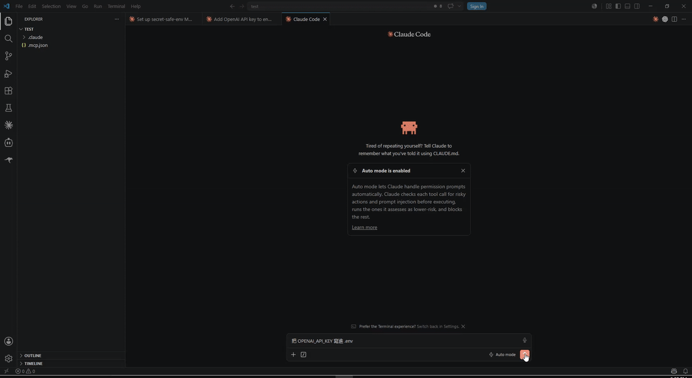

# secret-safe-env

[](https://www.npmjs.com/package/secret-safe-env)
[](https://registry.modelcontextprotocol.io/v0/servers?search=io.github.irrenwill/secret-safe-env)
[](./LICENSE)
[](#platform-support)

A [Model Context Protocol](https://modelcontextprotocol.io) server that lets an AI agent put a secret (API key, token, password, connection string) into a project's `.env` file **without the agent ever seeing the value**.

The agent calls a tool with **only the variable name**. A native, masked Windows dialog opens locally; **you** type the value; a local PowerShell helper writes it straight to `.env`. The agent receives only a status token (`OK` / `CANCEL` / `ERR:<CODE>`) — never the secret.

> 繁體中文說明見 [README.zh-TW.md](./README.zh-TW.md).

## Demo



<sub>▶︎ <a href="https://github.com/irrenwill/secret-safe-env/releases/download/v0.1.2/demo.mp4">Full-quality video (with audio)</a></sub>

---

## Why

When you ask an agent to "add my OpenAI key to `.env`", the usual paths all leak the secret: pasting it into the chat puts it in the model's context and transcripts; letting the agent write the value means the agent handled it; `cat .env` to "verify" exposes it again. `secret-safe-env` removes the secret from every one of those channels — the value travels **user → masked dialog → PowerShell → `.env`** and never enters the agent/model context.

```
agent: set_env_secret({ key: "OPENAI_API_KEY" })
          │  (name only — no value)
          ▼
   ┌──────────────────────────┐     you type the value here
   │  native masked dialog     │ ◄── (never shown to the agent)
   └──────────────────────────┘
          │  $script:SecretValue (never a parameter, never stdout)
          ▼
   PowerShell writes .env via [System.IO.File]
          │
          ▼
agent receives:  "OK"   ← status token only
```

### "Can't I just edit `.env` myself?"

Yes — and this doesn't replace that. It removes the repetitive *leave the chat → open the file → paste* step so the agent handles it inline, with you only typing the value once. It also guards a **different** surface than `.gitignore`: keeping `.env` out of git doesn't help if the value already leaked into the chat / transcript / logs the moment you handed it over. Scope is deliberately just *getting the value safely into `.env`* — production secret management (vaults, runtime injection) is out of scope.

## Platform support

This tool is **Windows-only by design** — the trust anchor is a native WinForms masked dialog driven by Windows PowerShell.

| Requirement | Supported | Notes |
|---|---|---|
| **Windows 10 / 11** | ✅ Required | The only supported OS. |
| **Linux / macOS** | ❌ Not supported | The tools return `UNSUPPORTED_PLATFORM` and refuse; the agent is told the machine is unsupported. (The npm package still *installs* on any OS, it just won't run there.) |
| **Windows PowerShell 5.1** | ✅ Required | Launched from the **pinned path** `%SystemRoot%\System32\WindowsPowerShell\v1.0\powershell.exe`. |
| **PowerShell 7+ (`pwsh`)** | ❌ Not used | Deliberately never PATH-resolved, so a `pwsh` on `PATH` can't change the execution/logging surface. |
| **Node.js** | ✅ 18+ | Runs the MCP server (spawns PowerShell; never touches the value). |

## Install

### Claude Code

```bash
claude mcp add secret-safe-env -- npx -y secret-safe-env
```

For the most stable setup (no `npx` cache surprises), install the global bin and point at it:

```bash
npm i -g secret-safe-env
claude mcp add secret-safe-env -- secret-safe-env
```

> Updating: `npm i -g secret-safe-env@latest`. With unpinned `npx`, clear the cache (`npx clear-npx-cache`) or pin a version (`npx -y secret-safe-env@<version>`) to avoid running a stale cached copy.

### Other MCP clients (`.mcp.json`)

```jsonc
{
  "mcpServers": {
    "secret-safe-env": { "command": "secret-safe-env" }        // requires `npm i -g secret-safe-env`
    // zero-install alternative (pin a version):
    // "secret-safe-env": { "command": "npx", "args": ["-y", "secret-safe-env@<version>"] }
  }
}
```

Reload the client so it picks up the server. If an `npx`-launched stdio server appears in the list but never connects on Windows, wrap the command as `cmd /c npx -y secret-safe-env`.

## Tools

### `set_env_secret({ key, env_path? }) → status text`

Opens the masked dialog for `key`; the user types the value; the helper writes `key=value` to `.env`. Returns human/agent-readable text plus an error flag — **never** the value. `key` must be `UPPER_SNAKE_CASE` (`^[A-Z_][A-Z0-9_]*$`). Values are **single-line** (for multi-line PEM/JSON, ask the user to edit `.env` manually). `destructiveHint: true` (it upserts a key in place).

### `env_key_exists({ key, env_path? }) → { exists: boolean }`

Returns only whether `key` is present in `.env` — never the value. Use it to confirm a write **instead of reading/`cat`-ing `.env`**. `readOnlyHint: true`.

> `env_path` is the absolute path to the project `.env`. **Always pass it explicitly** — a runner-launched MCP server's working directory is the runner sandbox, not your workspace. If omitted it defaults to `<CLAUDE_PROJECT_DIR or cwd>/.env`.

## For AI agents

Use `set_env_secret` **whenever a task needs a secret/API key/token/password/credential in a project `.env`** (e.g. "add my OpenAI key", "set `DATABASE_URL`", "configure my `.env`"). Rules:

- ✅ Pass **only the variable name**; the user supplies the value in the local dialog.
- ✅ Confirm a write with `env_key_exists` (returns `true`/`false`, never the value).
- ❌ **Never** ask the user to paste the secret into the chat.
- ❌ **Never** write the value or a placeholder yourself.
- ❌ **Never** `cat`/read `.env` to verify — that re-exposes the secret.

These rules are also delivered to the agent via the server's `instructions` and each tool's `description`, so a cold agent with zero prior context can use it correctly.

## Security scope

**In scope** — from the moment you type the value until it lands in `.env`, no audited Windows/agent channel records it: PSReadLine history, 4688/Sysmon process command lines, 4103 Module Logging, 4104 Script Block Logging, PowerShell Transcription, AMSI, the MCP/agent context, OTEL traces, and `mcp-debug` logs. The value never crosses a PowerShell parameter boundary and is written only via `[System.IO.File]`, never a cmdlet. A static AST lint (`npm run lint:ps`) and Pester transcript tests enforce this.

**Out of scope** (your responsibility, once the value is in `.env`) — cloud sync / OneDrive, VSS / backup snapshots, antivirus scanning, file ACLs, and the agent reading `.env` afterward.

See [docs/SPEC.md](./docs/SPEC.md) for the full threat model and guarantees.

## Development

```bash
npm install
npm run build       # tsc -> dist/
npm test            # Node unit tests (vitest)
npm run test:ps     # PowerShell upsert + no-leak tests (Pester 5)
npm run lint:ps     # static value-path AST lint
```

PowerShell tests need Pester 5: `Install-Module Pester -MinimumVersion 5.0 -Scope CurrentUser`.

Releases are automated: push a `vX.Y.Z` tag and GitHub Actions publishes to npm (Trusted Publishing / OIDC) and the MCP Registry — no tokens. See [docs/DECISIONS.md](./docs/DECISIONS.md).

## Documentation

- [docs/SPEC.md](./docs/SPEC.md) — purpose, guarantees, threat model, scope & non-goals.
- [docs/ARCHITECTURE.md](./docs/ARCHITECTURE.md) — modules and data flow.
- [docs/DECISIONS.md](./docs/DECISIONS.md) — design decisions and rationale.

## Contributing

Contributions welcome — see [CONTRIBUTING.md](./CONTRIBUTING.md). The one rule: keep the no-leak guarantee intact and tested.

## License

[MIT](./LICENSE)

## Disclaimer

`secret-safe-env` is provided "as is", without warranty of any kind (see [LICENSE](./LICENSE)). It reduces secret exposure within the documented [security scope](#security-scope) on a best-effort basis; it does **not** guarantee absolute secrecy. You are responsible for confirming it fits your threat model, and for whatever happens to a value **after** it is written to `.env` — cloud sync, backups, antivirus, file permissions, and any tool (including the agent) that later reads `.env`. For production secrets, prefer a dedicated secrets manager.

This is an independent open-source project. It is **not** affiliated with, endorsed by, or sponsored by Anthropic, "Claude", or the Model Context Protocol project; those names belong to their respective owners and are used only to describe compatibility.
